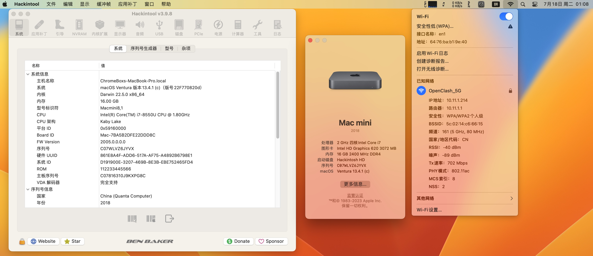

# Asus-ChromeBox-i7-8550U

Model：wAsus Chromebox 3  CN65 （Teemo）

FW：MrChromebox-4.20.0 05/15/2023 （Coreboot BIOS）

CPU：Intel Core i7-8550U @1.8Ghz 4C 8T

 

目前驱动的完美度（95%+ 完美度）：

- [x] 睡眠唤醒
- [x] DP 4k@60 Hz 视频输出
- [x] HDMI 4k@30 Hz 视频输出
- [x] USB 定制全部正常工作
- [x] 苹果拆机网卡支持苹果的所有功能

目前待解决的问题（交给后人解决 国光我没有精力用爱发电了）：

- [ ] BIOS 很简洁，DVMT 缺失导致 4k 显示器下 HiDPi 效果不够清晰
- [ ] 传感器细节优化，目前无法在 macOS 下手动调节风扇转速
- [ ] 3.5mm 耳机接口驱动，因为目前 Windows 下也是无解的，所以 macOS 也没有搞定（没想去折腾主要）

因为黑苹果驱动定制是很耗费时间的事情，为了追求完美需要各种优化，生活不易，猫猫叹气，如果你恰巧财力雄厚的话，可以考虑打赏下本文哦，打赏情况国光我也会同步更新我的打赏列表的：[打赏列表 | 国光](https://www.sqlsec.com/reward/) 

<table>
    <tr>
        <td>
            

        </td>
        <td width="50%">
            

        </td>
    </tr>
</table>

